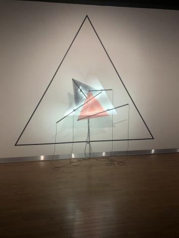
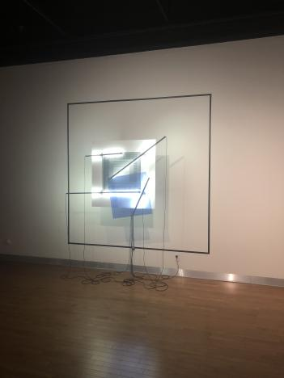
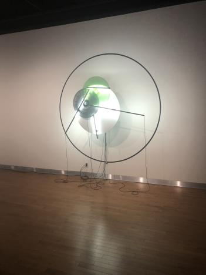
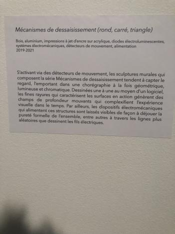

# Portfolio_Tommy_Lemay_Configuration_du_sensible
## Titre de l'oeuvre ou de la réalistion
Mécanismes de dessaisissement (rond, carré, triangle)
## Nom de l'artiste ou de la firme 
Béchard Hudon
## Année de réalisation
2019-2021
## Nom de l'exposition ou de l'évènement
Configurations du sensible
## Lieu de mise en exposition
Laval, salle Alfred-Pellan
## Date de votre visite
16 mars 2021

## Description de l'oeuvre ou du dispositif multimedia

## Explications sur la mise en espace de l'oeuvre ou du dipositif
Ce sont trois formes géométriques éloignées de chacune d'elles, éclairées par des led, disposant d'un mécanisme qui les fait bouger.

## Liste des composantes et techniques de l'oeuvre ou du dispositif
Led
Forme géométriques faites en tissu créé par ordinateur
Mécanisme
## Liste des éléments nécessaires pour la mise en exposition
Formes géométriques
Led
# Expérience vécue :
J'ai été décu de mon expérience vécue, car l'oeuvre n'a pas réellement d'intéret. En effet, l'oeuvre est contemplative, mais n'exprime pas vraiment quelque chose.
## Description de votre expérience de l'oeuvre ou du dispositif, de l'interactivité, des gestes à poser, etc.
C'est une oeuvre de contemplation, elle nous invite à regarder les formes qui bougent.
## Ce qui vous a plu, vous a donné des idées et justifications
J’ai bien aimé l’idée des mouvements hasardeux des formes géométriques.
## Aspect que vous ne souhaiteriez pas retenir pour vos propres créations ou que vous feriez autrement et justifications
Je pense qu’il aurait été mieux de cacher des fils, car selon moi il y a beaucoup trop de fils. Je trouve que l’œuvre est gâché par ces trop nombreux fils.
